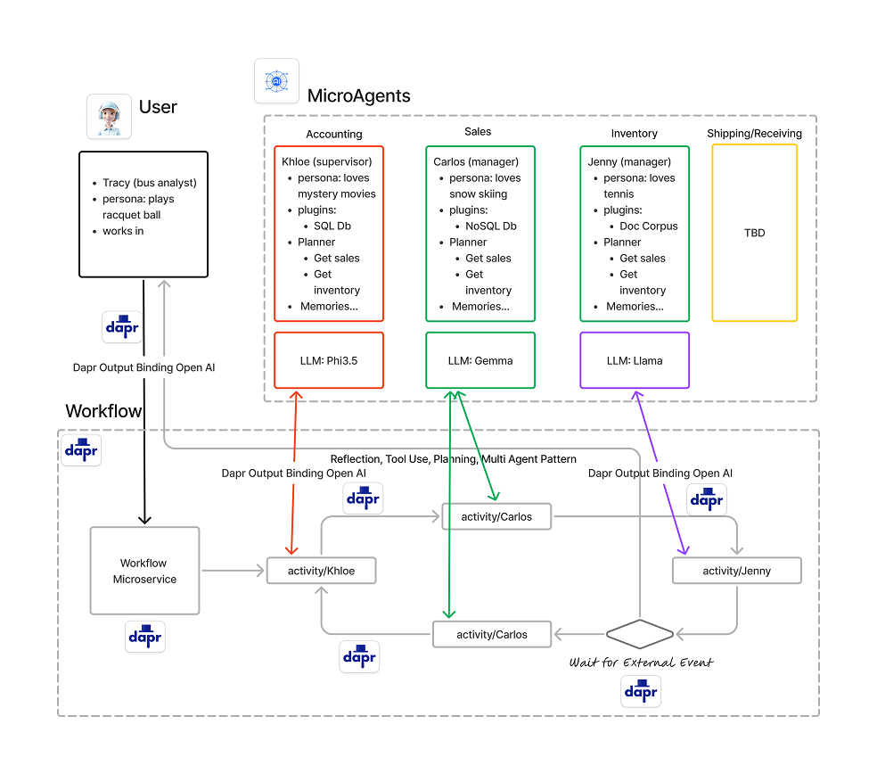

# 1. Agentic Dapr Demo Application (summary)
A demo application employing domain driven design, Dapr (Distributed Application Runtime) and an Agentic architecture with microagents. The system will use Dapr Workflows as the orchestrator in the agentic patterns. Each microagent will have semantic memory, plugins, planners, personas (Khloe, Jenny and Carlos) and memories. The microagents will assist the human chat by responding to prompts with both user and system prompts. The microagents will be feature extensions of microservices with in a bounded context. The bounded context will limit the behavior of the microagents funtionality. 

## 2. Purpose 

This demo will serve as a means to develop and perhaps improve Dapr building blocks. Agentic architectures are still in early stages but natural language based development is growing at an incredible rate. Upon its completion it can be used to show case Dapr integration in agentic architectures!

The following Dapr building blocks will be included in the demo
      - Configuration
      - Output Bindings
      - Workflows
      - State stores

We will omit gateways, authentication and middleware to keep focus on the above purpose.

# Table of Contents

1. Agentic Dapr Demo Application (summary)
2. Purpose
3. References
4. Project Description
      - Introduction
      - Domain model
      - Agentic Architecture
          - Dapr Building Blocks
          - Workflows
          - Output Bindings
          - Configuation
          - Vector Storage
      - MicroAgents
          - As a microservice feature
          - Working with the subdomain model
          - Memories
          - Plugins
          - Planners
          - Personas        
5. Installation
      - required software
6. Usage
      - running the demo app
      - prompting the app
7. Contributing
8. License
9. Contact Information
10. FAQ
11. Credit
12. Changelog

## 3. References:
- Domain Driven Design
- Distributed Application Runtime (Dapr)
- Agentic Architecture and related patterns
- Semantic Kernel
- Andrew Ng - Agentic Design Patterns
    - Reflection pattern
    - Tools pattern
    - Planner pattern
    - Multi Agent pattern

## 4. Project Description:
### Introduction
#### Domain Model
In order for microagents of an agentic architecture to work in context they should follow domain driven design principals.
They should follow all the domain contextual relationships and live within the boundaries of their respective bounded context. 

The following diagram is our demo basic domain with its various bounded context. We will keep it simple with only 3 contexts and a basic ubiquitous language.

  1. Accounting (Kloe) - Accounts receivables and payables. They are the manager of all operations. Use a SQL database for receivables and payables.
  2. Sales (Carlos) - Widgets in the sales pipleine. Uses Saleforce API and a NoSQL database for data storing orders.
  3. Inventory (Jenny) - Widgets in inventory. Use SQL database for storage
  4. Shipping (Jenny) - Widgets in shipment. Use a SQL database for data storage of shipped widgets.
  5. Receiving (Jenny) - Widgets on order. Use a document corpus for storing received widget stock.

This is a very general domain model with its related contexts. The U/D denotes an upstream/downstream relationship between contexts. PL denotes a Published Language as in Sales Force API. CS denotes Customer Supplier relationship and of course there is a Partnership relationship between Accounting and Inventory. The XRay icon denotes a Big Ball of Mudd or a legacy Inventory system. So we have many of the hybrid conditions found in most enterprises.

In agentic AI architectures an orchestrator is needed utilizing a saga or orchestrator design pattern. (verus choreographer however both should be considered)
The orchestrator is the central manager of the agentic chat and coordinates messaging between microagents. A microagent follows the microservices pattern of a ganular application that centers around a specific domain model.

More can be elaborated on best practices design for microagents but its recommended that a vertical slice architecture as used inmicroservices will suffice for now. A microagent can be a feature of a microservice as to not over granularize as a separate service.

### Agentic Design Patterns
The following diagrams depict the overall architectural elements and information flow. The first is a series of diagrams depicting the 4 main agentic patterns by Andrew Ng. The demo will be implementing all 4 to a limited extent.

- Reflection Pattern: 
- Tool Use Pattern:
- Planning Pattern:
- Multi-Agent Pattern:

### Agentic Architecture with MicroAgents
The following diagram illustrates the scope of the demo and overall architecture. It is not a production worthy system as gateways, authorization, encryption and real business domains are omitted for purposes of clarity.

# 5. Installation
      - required software
# 6. Usage
      - running the demo app
      - prompting the app
# 7. Contributing
# 8. License
# 9. Contact Information
# 10. FAQ
# 11. Credit
# 12. Changelog
