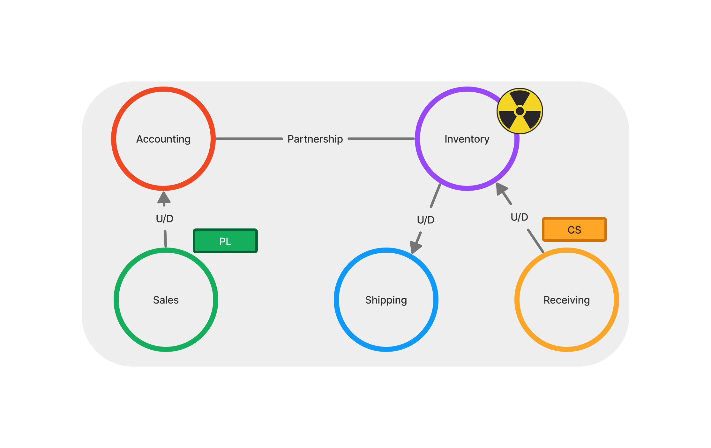
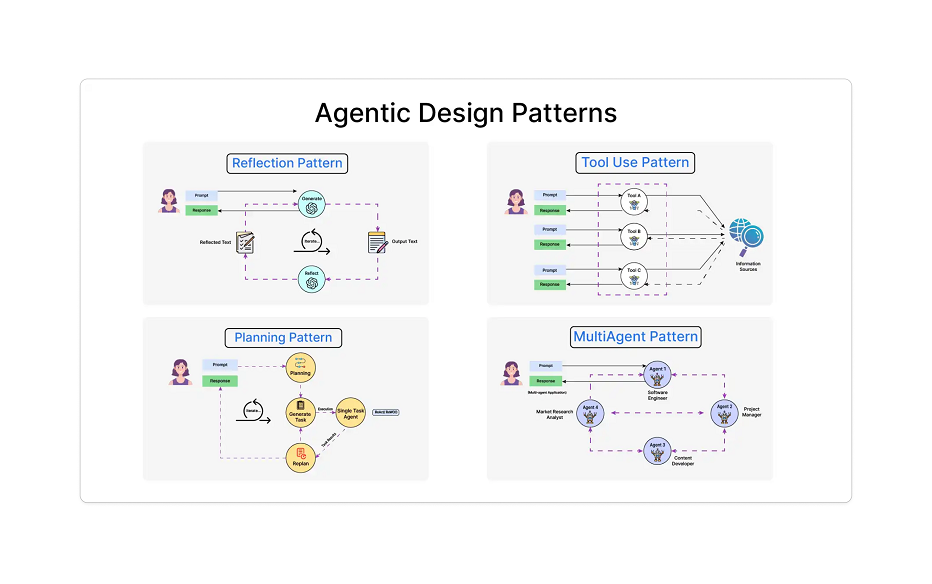
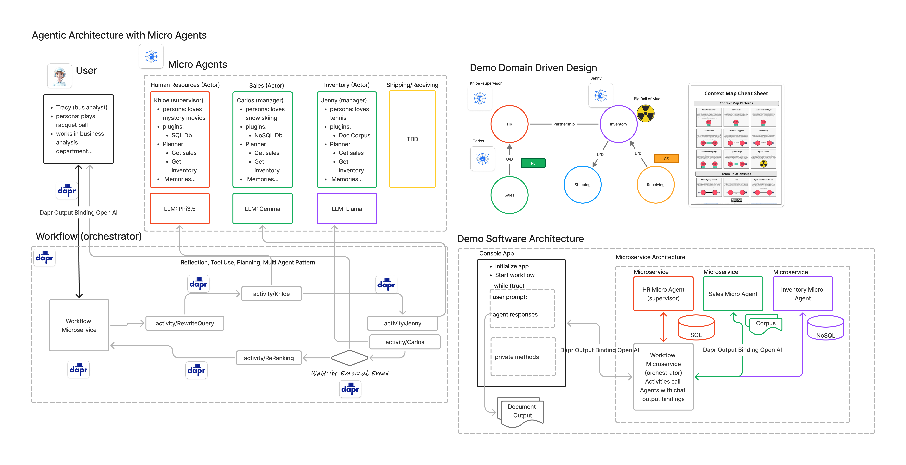
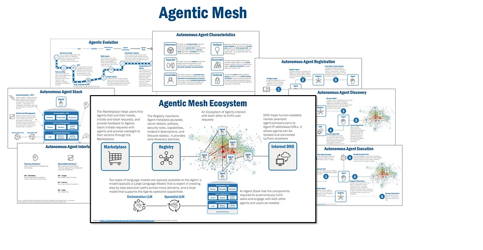
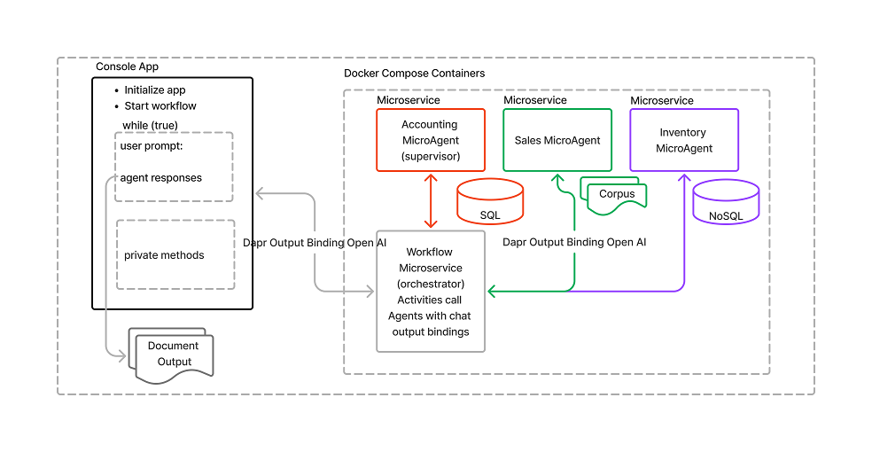

# 1. Agentic Dapr Demo Application (summary)
A demo application employing domain driven design, Dapr (Distributed Application Runtime) and an agentic architecture with micro agents. The system will use Dapr Workflows as the orchestrator in the agentic system. Each micro agent will have semantic memory, plugins, planners, personas (Khloe-supervisor, Jenny and Carlos) and memories. The micro agents will assist the human completion chat by responding to prompts with user, meta (personas) and system prompts. The micro agents will be feature extensions of microservices with in a bounded context. The bounded context will limit the behavior of the micro agents funtionality as virtual domain experts. 

## 2. Purpose 

This demo will serve as a means to observe, develop and improve how Dapr Workflows and components work with agentic architectures. Agentic architectures are still in early stages but natural language based development is growing at an incredible rate. The most salient issue to discuss should be eventual consistency in distibuted environments such as microservices. How can workflows assist agentic systems to maintain side effects in a distributed architecture? Upon its completion it can be used to show case Dapr integration in agentic architectures. 

The following Dapr building blocks will be included in the demo
      - Configuration
      - Output Bindings
      - Workflows
      - State stores

We will omit gateways, authentication and middleware to keep focus on the above purpose.

## 3. References:
- Domain Driven Design
- Distributed Application Runtime (Dapr)
- Agentic Architecture and related patterns
- Semantic Kernel
- Andrew Ng - Agentic Design Patterns
    - Reflection pattern
    - Tools pattern
    - Planner pattern
    - Multi Agent pattern

## 4. Project Description:

### Domain Model
In order for micro agents of an agentic architecture to work in context they should follow domain driven design principals.
They should follow all the domain context relationships and live within the boundaries of their respective bounded context. 

The following diagram is a basic domain with its various bounded context. We will keep it simple with only 3 contexts and a basic ubiquitous language.

  1. Accounting (Khloe) - Accounts receivables and payables. They are the manager of all operations. Use a SQL database for receivables and payables.
  2. Sales (Carlos) - Widgets in the sales pipleine. Uses Saleforce API and a NoSQL database for data storing orders.
  3. Inventory (Jenny) - Widgets in inventory. Use SQL database for storage
  4. Shipping (Jenny) - Widgets in shipment. Use a SQL database for data storage of shipped widgets.
  5. Receiving (Jenny) - Widgets on order. Use a document corpus for storing received widget stock.

This is a very familiar and general domain model with its related contexts. The U/D denotes an upstream/downstream relationship between contexts. PL denotes a Published Language as in a Sales Force API. CS denotes Customer Supplier relationship and of course there is a Partnership relationship between Accounting and Inventory. The Xray icon denotes a Big Ball of Mudd or a legacy inventory system. We have many of the hybrid conditions found in most enterprises.

In agentic AI architectures an orchestrator is needed utilizing a saga or orchestrator design pattern. (verus choreography however both should be considered)
The orchestrator is the central manager of the agentic chat and coordinates chat completion messaging between micro agents. A micro agent follows the microservices pattern of a ganular application that centers around a specific domain model.

More can be elaborated on best practices design for micro agents but its recommended that a vertical slice architecture as used in microservices will suffice. A micro agent can be a feature of a microservice as to not over granularize as a separate service.

### Agentic Design Patterns
The following diagrams depict the overall architectural elements and information flow. The first is a series of diagrams depicting the 4 main agentic patterns by Andrew Ng. The demo will be implementing all 4 to a limited extent.

- Reflection Pattern 
- Tool Use Pattern
- Planning Pattern
- Multi-Agent Pattern

### Agentic Architecture with MicroAgents
The following diagram illustrates the scope of the demo and overall architecture. It is not a production worthy system as gateways, authorization, encryption and core business domains are omitted for purpose of clarity.

The following is the demo software design. The main app is a .NET console application with a while(true) loop with write line prompts and read line outputs. It will also have 4 additional .NET Core APIs and microservices.

- ClientApp - Console application. Main chat initiation and dialogue, starts workflow and keeps history.
- AgenticWorkflow.API: Orchestrator pattern that maintains conversation state, app crash resilience and external calls.
- Accounting.API: Contains a micro agent feature that acts on behalf of the domain. Its domain model is persisted uses an SQL database.
- Inventory.API: Contains a micro agent feature that acts on behalf of the domain. Its domain model is persisted by a NoSQL database.
- Sales.API: Contains a micro agent feature that acts on behalf of the domain. Its domain model is persisted by a document corpus.

<!--### Future Using Agentic Mesh

The more recent and advanced initiatives are moving to the idea of an agentic mesh. The mesh or service mesh would make micro agents fully discoverable. The mesh would give better security with LLMs and in transit data. The service mesh establishes a control and data plane. Micro agents are proxied by sidecars acting on behalf of the agent. Dapr workflows and functionalality can use these sidecars instead of Dapr sidecars. This will be included in subsequent releases of this demo as a full scale cloud deployment would be neccessary. See diagram below.

-->

### Demo Software Design
The above APIs will run in Docker Compose as container based apps with respective ports. The console app will start the workflow and setup Semantic Kernel SDK. It then implements a client console application that prompts AI. The prompts will make calls via the Dapr Output Bindings Chat Completion component to the work flow. Micro agent to micro agent chat completion will also be handled by chat completion output bindings. The micro agents contain their own plugins, personas, planners and memories. The Dapr wait for external call we be used to call back to the console client from a micro agent downstream. Finally documents will be requested by the supervisor micro agent from the other agents and saved to a local folder.

Its important to note that the workflow will first implement query rewriting as the basis of contacting and orchestrating micro agents. Finally at the end it will re-query the aggregated results and refine the prompt request.

# 5. Installation
      - Visual Studio 2022 (with powershell tools extension)
      - Docker Desktop (latest)
      - Dapr Client and Runtime 1.14
      - Ollama (install/run phi3, llava-phi3, llama3.1, llama3, orca-mini, wizardlm2)
# 6. Usage
      - running the demo app
      - prompting the app (coming soon as UX)
# 7. Contributing
# 8. License
# 9. Contact Information
# 10. FAQ
# 11. Credit
# 12. Changelog
